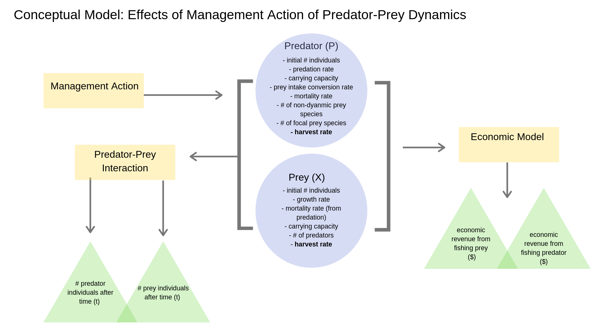

```{r setup, include=FALSE}
knitr::opts_chunk$set(echo = TRUE)
```

```{r include=FALSE, message=FALSE}
library(tidyverse)
library(citr)
```

##Recovery times and spatial management of Fisheries 
#### Motivation 

Marine reserves are used widely to meet a myriad of objectives including biodiversity protection and fisheries management. One advantage of marine reserves over traditional fishery management is that reserves protect not only target species but also habitat and non-target species [@micheliINCLUDINGSPECIESINTERACTIONS2004]. However, marine reserve theory has largely focused on single species recovery. Few studies have focused on the effects of marine reserves on multi-species interactions and how these interactions can affect population recovery time and maximize fishery benefits [@baskettDesigningMarineReserves2007; @samhouriRapidDirectRecoveries2017]. We chose to focus on predator-prey interaction as "fishing down the foodweb" is a common phenomenon in fisheries. As abundances of organisms in higher tropic levels are reduced (in many cases due to fishing), effort is then focused on lower trophic levels gradually moving down the food web [@paulyFishingMarineFood1998]. 

*Our guiding question:* How does taking predator-prey interactions into account in marine reserve theory influence their recovery times and thus fishery benefits? How do these results compare to other single species management measures (such as single species closures)? We re-create models presented in @samhouriRapidDirectRecoveries2017 as a basis and introduce marine reserves as an additional management intervention.  

*Our main goal:* To identifying how biomass of predators and prey will react to management interventions in the form of various sizes of marine reserves and single speices closures. The output will include a table and graphs with prey abundance (# of individuals), predator abundance (# of individuals), size of reserve (% of total area), and time (year).

*Target audience:* This model will be beneficial to resource managers and planners who use marine reserves with the main goal of multi-species fisheries recovery.

#### Sub models 
 
##### 1. Predator-prey model 
To simulate interaction between predator and prey, including growth, harvest and competition among species. This model will be dynamic, stochastic and abstract. Inputs will include biological parameters such as intrinsic growth rate, carrying capacity and competition coefficients, as well as, harvest rates (Table 1). Outputs will be population sizes in each year and harvest of predator and prey. The model will utilize generalist predator-prey variables, thus sensitivity analysis will be conducted for intrinsic growth rates.

Interactions of generalist predator prey dynamics are mathematically described as follows [@samhouriRapidDirectRecoveries2017]: 

$$\frac{dX}{dt}=r_XX(1-\frac{X}{K_X})- a_XPX-h_XX$$
$$\frac{dP}{dt}=P[c(a_XX + a_XY)-d_P](1-\frac{P}{K_P})- h_PP$$


```{r, echo= FALSE}

Varible <- list("P", "X", "Y", "rx", "dp", "kp", "ax", "ay", "hp", "hx")

Description <- list("Predator", "Focal prey", "Non-dynamic prey", " Growth rate prey", "Predator mortality rate", "Predator carrying capacity", "Predation rate on focal prey", "Predation rate on non-dynamic prey", "Predator harvest rate", "Focal prey harvest rate") 
             
Units <- list("# individuals", "# individuals", "# individuals", "y^-1", "y^-1", "# individuals", "# individuals^-1*y^-1", "# individuals^-1*y^-1","y^-1", "y^-1"  )

parameters <- cbind(Varible, Description, Units) %>%
  data.frame()

knitr::kable(parameters, align= 'l', caption= "Table 1. List of Parameters")

```


#####2. Marine reserve model
A patch model to simulate predator-prey interactions given spatial closures. Space will be represented by a series of vectors. Sensitivity analysis will be conducted on the size of the closure, represented by number of patches closed where $h_X$ and $h_P$ = 0. The model will be spatial, static, stochastic and abstract. For example a spatial closure of 100% of patches would result in $h_X$ and $h_P$ = 0.

#####3. Economic Model 
To generate net present value generated by harvest of predator and prey. Inputs to this model will include price of species ($/individual), amount harvested (# of individuals), discount rate (%) and time (years). The model will be deterministic.

Net present value (NPV) of harvest from predator and prey will be calculated using the following equation:

$$ NPV = \frac{PH}{(1+D)^t} $$
Where P is the market price, H is harvest, D is the discount rate and t represent time in years.

##### 4. Wrapper of these three models 
A wrapper function will be used to simulate predator-prey dynamics given the marine reserve model implementation and calculate economic returns. The function will also output relevant graphs over projected time. 

Model simulations will follow the following steps:  
  1. Allow the system to run until equilibrium with no intervention  
  2. Simulate trophic downgrading by harvesting the predator until equilibrium and then harvesting the prey until a new equilibrium is reached.   
  3. Implement one of the following management strategies:   
  i.) Harvest of both species is reduced due to marine reserve implementation at various sizes, where a marine reserve of 100% of the area results in harvesting of both species be equal to 0 and thus stopped completely.   
  ii.) Harvest of predator stops (i.e. $h_P$ = 0) until new equilibrium is reached, and then harvest of prey stops (i.e. $h_X$ = 0)  
  iii.)Harvest of prey stops (i.e. $h_X$ = 0) until new equilibrium is reached, and then harvest of predator stops (i.e. $h_P$ = 0)

#### Conceptual model  

```{r message=FALSE, echo=FALSE, out.width="400px", out.height="400px"}

```

#### References 


